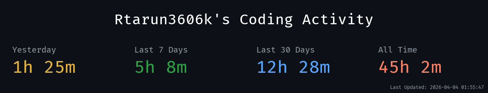
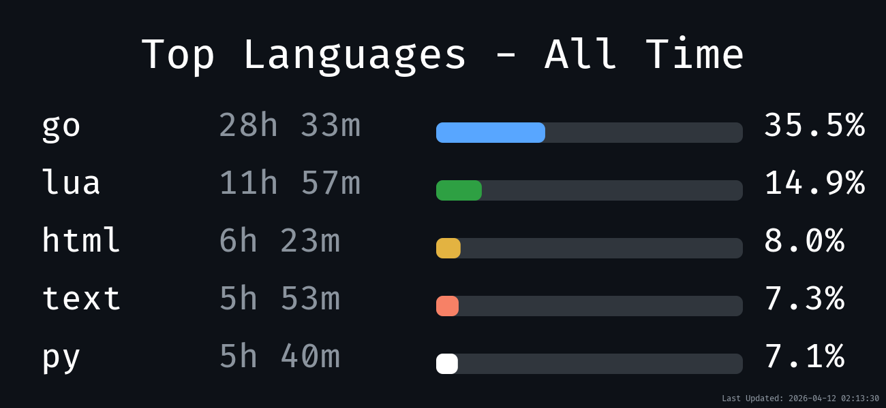
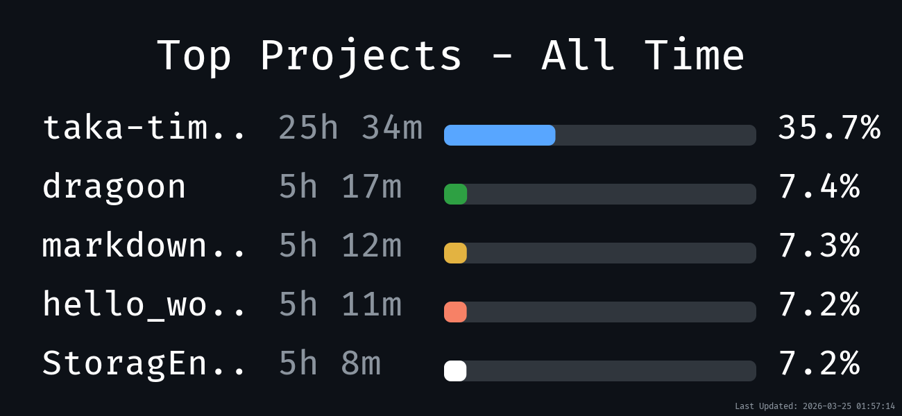
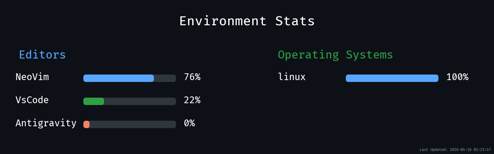

**This repo is supposed to be used as config by NvChad users!**

- The main nvchad repo (NvChad/NvChad) is used as a plugin by this repo.
- So you just import its modules , like `require "nvchad.options" , require "nvchad.mappings"`
- So you can delete the .git from this repo ( when you clone it locally ) or fork it :)

# Credits

1) Lazyvim starter https://github.com/LazyVim/starter as nvchad's starter was inspired by Lazyvim's . It made a lot of things easier!

<!--takatime-start-->

<h2 align="center">TakaTime Weekly Report</h2>

   
  
   
  

<em>Generated automatically by <a href="https://github.com/Rtarun3606k/TakaTime">TakaTime</a></em>

<!--takatime-end-->
